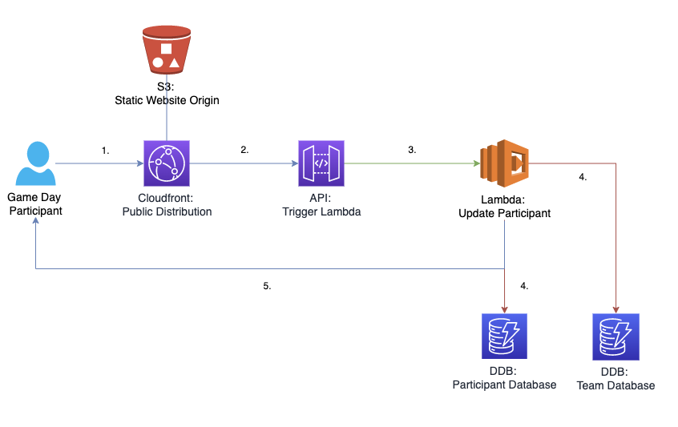

# SignUpSheet
AWS Game Day web application for use with customers the morning of the event as a way to assign teams in an automatic fashion.

# TODO

1. Attempt to break things by changing common parameters such as team size, event rooms, etc...
2. Reach out to specialist for AppSec guidance
3. Check for code functionality with bulk subscribes
4. Add functionality for CodeDeploy from Github
5. Add functionality for updates to existing CloudFormation Template

# TLDR

1. Upload files from S3 Bucket Files to your own S3 Bucket
2. Check the event breakout room links are up to date or delete the file (requires one link per team. If the file exists, it must have updated links)
2. Verify an Email in SES in the region you want to run the application
3. Ensure you are out of Sandbox mode in SES
4. Run the **GameDaySignUpSheet** CFT template in the region your verified email is in
5. Provide the Cloudfront link to your attendees the morning of the event (found in the outputs section of the CFT)
6. (During the event) Go to the secondary page, found in the outputs of the CFT to edit teams if necessary

# Prerequisites

## AWS Account

**Permissions**: In order to run the CFT, you'll need an AWS Account, and an AWS IAM user in that account with at least full permissions to the following AWS services:

- AWS IAM
- Amazon S3
- Amazon CloudFront
- Amazon Lambda
- Amazon DynamoDB
- Amazon API Gateway
- Amazon SES
- Amazon SNS

**Use Your Own Account**: You may use a personal account to spin up the resources for this Sign Up Sheet.

**Costs**: There are minor costs associated with this sign up sheet and it should be destroyed soon after the event ends. You may even destroy the resources for this App immediately after finalizing the teams, although I suggest waiting until after the event as some of the team information may be useful when sending prizes to the winners

## SES Email

**Verified Email**: This web application sends emails to the participants with their team information and links to the event rooms. In order to accomplish this, we utilized Amazon SES. SES requires a verified email from which to send out messages to participants and it will not work otherwise. Because this service is regional, please verify an email with AWS SES in the same region that you run the CFT template from and include that as your default region. This is also a parameter in the CFT and is required

**SandBox Mode**: SES is by default in sandbox mode and you must submit a request to remove your account from Sandbox mode before using this App

## AWS Region

You must spin up the CFT in the same region as the email you have verified previously. The CFT includes this as a parameter and uses by default the us-east-1 region

## S3 files

**Website Files**: Until the application can be green lit by AppSec, you must provide the website files in a local bucket in your account, then update the parameters in the CFT.

**Lambda Function Files**: Until the application can be green lit by AppSec, you must provide the Lambda function files in a local bucket in your account, then update the parameters in the CFT. The CFT checks the bucket for the keys with the pattern: "Lambdas/files.zip"

# CFT Parameters

**APIGatewayEndpointType**: Type REGIONAL for local events and EDGE for world-wide events. Refers to the Cloudfront caching strategy

**DefaultRegion**: Main region for your stack, should be in the same region as your SES verified email

**EventRoomFilesBucket**: Bucket you're using to store your Event room files in. I used the same bucket as the Website files

**EventRoomFileKey**: Do not change

**LambdaFilesBucket**: Bucket you're using to store your Lambda files in. I used the same bucket as the Website files

**LambdaZipNameDatabase**: Do not change

**LambdaZipNameEmail**: Do not change

**LambdaZipNameTeamChange**: Do not change

**LambdaZipNameWebsite**: Do not change

**MainEventRoom**: Link to the main event room (Example https://company.zoom.us/u/abte3F12Rq)

**MaxTeamSize**: Maximum number of participants per team, default of 4

**MaxTeams**: Maximum number of teams you expect at the event. This should be the number of attendees that have registered divided by 4 (or max team size)

**SESVerifiedEmail**: Email verified in SES that you will use as a source Sender to pass messages to participants

**SourceBucket**: Bucket you're storing the website files in. I used the same bucket as the Lambda files

# Application Logic

## Front End

Uses a static website hosted in S3. HTML for the front end and JavaScript for the backend. Users submit their information which simply forwards it to an API and then to a Lambda Function. The website automatically points to the newly created API upon creation

## Database Lambda Function Logic

First lambda (Database Update Function) receives the participant information, including:
1. Full Name
2. Email (used for confirmation or switching teams, so requires input twice)
3. Company (might remove, wanted for multi-customer events)
4. Location (might remove)
5. Job Title (used for event host to deduce experience, but is likely redundant. Might remove)
6. AWS Experience (Self rated. Scale of 0-5 with 0 being no experience and 5 being absolutely confident)
7. Virtual Attendance (For Hybrid Game Days. Might remove)

Once the Database Update Function receives the information, it runs through approximately 2 types of passes over the databases: Distribution rounds, and Database Passes

**Distribution rounds**: Currently up to three rounds. The current number (1, 2, or 3) will force the function to fill up the first 50% of teams completely, then the next 25% and finally the last 25%. Logic is simple enough to add even more distribution rounds if required.

**Database Passes**: There are up to three passes over the database with decreasing strictness.

1. First pass: Enforces a maximum of 1 highly experienced player (rated 4+), a maximum of 2 players with middle experience (rated 3), and a maximum of 2 low experience players (rated <=2)
2. Second pass: Enforces a maximum of 2 highly experienced player (rated 4+), a maximum of 3 players with middle experience (rated 3), and a maximum of 3 low experience players (rated <=2)
3. Third pass: No restrictions on teams, this pass prioritizes filling up teams up to the maximum team distribution determined by the Distribution Round #

Once a team is found, the lambda updates the Participant database with the team members provided information and assigns the team number. Then it updates the Team database with the Team information

If all the teams are full, the participant will receive a notification that the assignments failed. If this happens, make sure to check your MaxTeams parameter in the CFT template.

##Email Lambda Function Logic

The second Lambda watches the Participant database streams for any changes and automatically sends an email to the participants using the provided email. The lambda assumes the email provided from the CFT template is SES verified and the account is not in Sandbox mode. THERE IS NO NOTIFICATION IF YOU HAVE NOT PROPERLY SET UP THE SES EMAIL! IT WILL SIMPLY FAIL!
